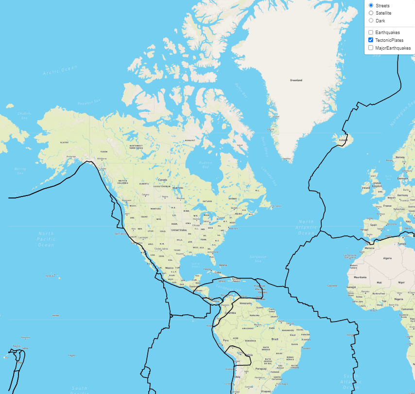
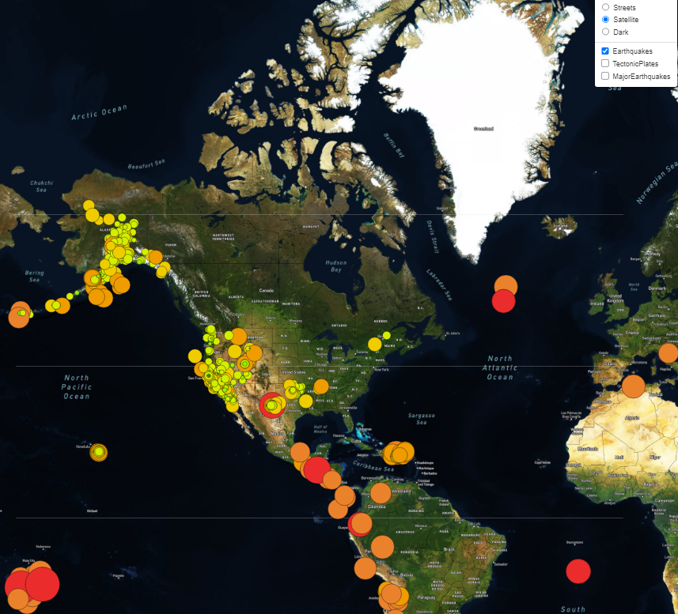
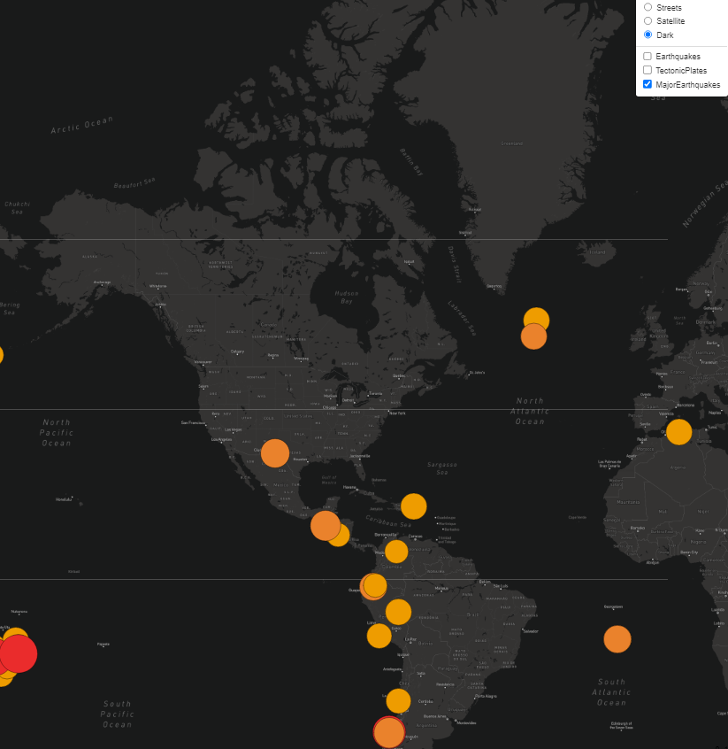

# Mapping Earthquakes

## Overview

The objective of this assignment was to create a functional and interactive Maps webpage. The various functions include:

- 3 different toggable tile layers (Streets, Satellite, and Dark)
- Pop up boxes for that hold the location and magnitude
- 3 data sets that you can toggle (All Earthquakes, Tectonic Plates, and Major Earthquakes)

### Results

Street View with Tectonic Plates

Satelitte with All Earthquakes

Dark with Major Earthquakes

